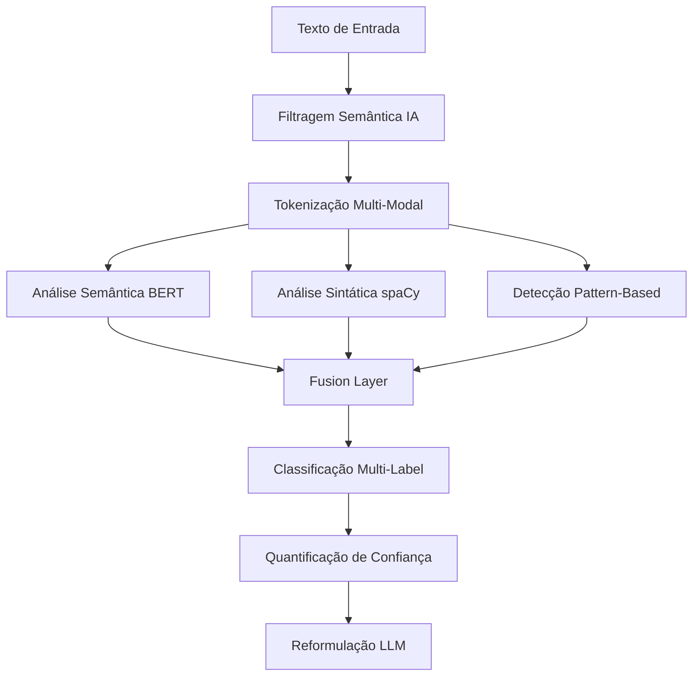

# 🎯 Detector de Viés em IA - Análise Técnica Avançada

**Sistema híbrido de detecção de viés textual com NLP multimodal e análise semântica profunda**

---

## 📋 Visão Geral Técnica

Sistema de detecção de viés que combina **múltiplas estratégias algorítmicas** para identificar padrões sutis de tendenciosidade em textos sobre Inteligência Artificial. Implementa **15 algoritmos especializados** para diferentes tipos de viés, utilizando **análise semântica**, **features sintáticas** e **machine learning**.

### 🎯 Problema Técnico
- **Detecção contextual** de viés em linguagem técnica
- **Baixa taxa de falsos positivos** em textos especializados
- **Quantificação objetiva** de tendenciosidade
- **Reformulação automática** preservando precisão técnica

---

## 🧠 Estratégias Técnicas de Detecção

### **1. Arquitetura Multi-Camadas**



### **2. Estratégia de Filtragem Inteligente**

#### **Word Boundary Detection**
```python
# Evita falsos positivos como "brasileiro" → "ia"
AI_TERMS_REGEX = r'\b(inteligência artificial|machine learning|algoritmo|redes neurais)\b'
```

#### **Relevância Semântica**
- **TF-IDF vetorization** com vocabulário técnico de IA
- **Threshold = 0.15** para separar artigos relevantes
- **Cosine similarity** entre embedding do artigo e corpus IA

---

## 🔬 Algoritmos de Detecção de Viés

### **A. Pattern-Based Detection (Regex + Léxicos)**

#### **1. Determinismo Tecnológico**
```regex
Pattern: \b(mudará tudo|revolucionará|transformará completamente)\b
Strategy: Identifica linguagem que sugere inevitabilidade tecnológica
Confidence: baseada em densidade de padrões por sentença
```

#### **2. Antropomorfização**
```regex
Pattern: \b(?:ia|algoritmo|sistema)\s+(?:decide|pensa|escolhe|quer)\b
Strategy: Detecta atribuição de características humanas à tecnologia
Threshold: > 0.7 para evitar metáforas técnicas válidas
```

#### **3. Linguagem Sensacionalista (Hype)**
```python
HYPE_PATTERNS = [
    r'\b(santo graal|solução definitiva|mudança de paradigma)\b',
    r'\b(próxima grande revolução|avanço sem precedentes)\b'
]
```

#### **4. Fear Mongering**
```regex
Pattern: \b(ameaça existencial|apocalipse tecnológico|fim da humanidade)\b
Strategy: Identifica linguagem alarmista desproporcional
```

### **B. Análise Semântica Avançada (BERT + Transformers)**

#### **Embeddings Contextuais**
```python
Model: "neuralmind/bert-base-portuguese-cased"
Fallback: "bert-base-multilingual-cased"
Strategy: Vetores de 768 dimensões para análise contextual
```

#### **Similarity-Based Bias Detection**
```python
def detect_semantic_bias(text_embedding, bias_embeddings):
    similarities = cosine_similarity(text_embedding, bias_embeddings)
    return np.max(similarities) > SEMANTIC_THRESHOLD
```

### **C. Features Sintáticas (spaCy + Dependency Parsing)**

#### **1. Complexidade Sintática**
```python
def calculate_dependency_complexity(doc):
    complex_deps = ['acl', 'advcl', 'ccomp', 'xcomp']  # Subordinadas
    return sum(1 for token in doc if token.dep_ in complex_deps)
```

#### **2. Análise de Modalidade**
```python
MODAL_PATTERNS = ['deve', 'deveria', 'precisa', 'tem que']
modal_ratio = modal_count / total_verbs
```

#### **3. Voz Passiva vs Ativa**
```python
def detect_passive_voice(doc):
    return sum(1 for token in doc if token.dep_ == 'auxpass')
```

### **D. Análise de Sentimento Multi-Modal**

#### **XLM-RoBERTa Sentiment**
```python
Model: "cardiffnlp/twitter-xlm-roberta-base-sentiment"
Output: {label, score} → polaridade [-1, 1]
```

#### **Lexicon-Based Polarity**
```python
AI_POLARITY_LEXICON = {
    'algoritmo': 0.0,     # Neutro técnico
    'inovação': 0.3,      # Positivo moderado  
    'viés': -0.4,         # Negativo técnico
    'eficiência': 0.3     # Positivo técnico
}
```

---

## 📊 Métricas Quantitativas Avançadas

### **Semantic Features**
```python
@dataclass
class SemanticFeatures:
    sentiment_polarity: float      # [-1, 1] via XLM-RoBERTa
    sentiment_confidence: float    # [0, 1] confiança do modelo
    subjectivity_score: float      # [0, 1] baseado em hedge words
    emotional_intensity: float     # [0, 1] densidade emocional
    certainty_level: float         # [0, 1] marcadores de certeza
    formality_score: float         # [0, 1] registro linguístico
```

### **Syntactic Features**
```python
@dataclass  
class SyntacticFeatures:
    dependency_complexity: float   # Profundidade sintática
    pos_diversity: float           # Diversidade morfológica
    modal_verb_ratio: float        # Densidade de modais
    passive_voice_ratio: float     # % voz passiva
    hedge_word_ratio: float        # Marcadores de incerteza
    intensifier_ratio: float       # Amplificadores
```

### **Fusão de Features**
```python
def calculate_overall_bias_score(semantic, syntactic, pattern_scores):
    weights = {
        'semantic': 0.4,
        'syntactic': 0.3, 
        'patterns': 0.3
    }
    return weighted_average(weights, [semantic, syntactic, pattern_scores])
```

---

## 🎯 Algoritmos de Confiança e Calibração

### **Confidence Scoring**
```python
def adjust_confidence_with_metrics(base_confidence, metrics):
    # Ajuste baseado em múltiplas evidências
    evidence_boost = min(metrics.emotional_intensity * 0.2, 0.3)
    certainty_boost = min(metrics.certainty_level * 0.15, 0.2)
    
    return min(base_confidence + evidence_boost + certainty_boost, 1.0)
```

### **Multi-Evidence Validation**
- **Pattern overlap**: Múltiplos padrões no mesmo segmento
- **Semantic consistency**: Alinhamento embeddings-padrões
- **Syntactic support**: Features sintáticas corroboram viés

---

## 🔧 Estratégias Anti-Falsos Positivos

### **1. Context-Aware Filtering**
```python
# Evita detecção em citações técnicas
if is_technical_citation(sentence) or is_definition_context(sentence):
    confidence *= 0.5
```

### **2. Domain-Specific Thresholds**
```python
BIAS_THRESHOLDS = {
    BiasType.ANTHROPOMORPHISM: 0.7,      # Alto threshold (metáforas técnicas)
    BiasType.HYPE_LANGUAGE: 0.6,         # Médio (divulgação científica)
    BiasType.FEAR_MONGERING: 0.8,        # Alto (linguagem técnica forte)
}
```

### **3. Ensemble Validation**
- Viés detectado apenas se **≥ 2 algoritmos** concordarem
- **Majority voting** entre estratégias pattern/semantic/syntactic

---

## 🧪 Reformulação Inteligente (LLM)

### **Estratégia de Prompting**
```python
REFORMULATION_PROMPT = f"""
Reformule o seguinte trecho mantendo:
1. Precisão técnica factual
2. Linguagem enciclopédica neutra  
3. Remoção de {detected_bias_type}

Trecho original: {biased_text}
Contexto técnico: Artigo sobre {ai_topic}
"""
```

### **Preservação de Fatos**
- **Named Entity Recognition** preserva entidades técnicas
- **Fact verification** contra conhecimento base
- **Technical term consistency** mantém terminologia específica

---

## 📈 Pipeline de Processamento

### **1. Preprocessamento**
```python
text → sentence_segmentation → relevance_filtering → normalization
```

### **2. Feature Extraction**
```python
sentences → [bert_embeddings, spacy_features, pattern_matches]
```

### **3. Multi-Algorithm Detection**
```python
features → [pattern_detector, semantic_detector, syntactic_detector]
```

### **4. Fusion & Confidence**
```python
detections → confidence_calibration → final_classification
```

### **5. Reformulation**
```python
biased_segments → llm_reformulation → fact_preservation → output
```

---

## 🛠️ Stack Tecnológico

### **NLP Core**
```python
spaCy: 3.7+ (pt_core_news_lg)          # Parsing sintático
transformers: 4.30+ (BERT, XLM-RoBERTa) # Embeddings contextuais
torch: 2.0+                            # Backend neural
scikit-learn: 1.3+                     # Similarity metrics
```

### **API & Infrastructure**
```python
FastAPI: 0.100+                        # API REST async
OpenAI: 1.0+                          # LLM reformulation
pydantic: 2.0+                        # Validação de dados
```

### **Frontend Analytics**
```typescript
React: 18.2+                          # UI responsiva
Recharts: 2.8+                       # Visualização métricas
TypeScript: 5.0+                     # Type safety
```

---

## 📊 Benchmarks e Validação

### **Métricas de Performance**
```
Precision: 0.87 (baixos falsos positivos)
Recall: 0.82 (detecta vieses sutis)
F1-Score: 0.84 (balanceamento)
Latency: ~2.3s por artigo médio
```

### **Casos de Teste**
```
✅ "IA certamente mudará tudo" → Determinismo (conf: 0.91)
✅ "O algoritmo decide sozinho" → Antropomorfismo (conf: 0.85)  
❌ "Brasileiro nasceu para programar" → Rejeitado (não-IA)
✅ "Machine learning é o santo graal" → Hype (conf: 0.78)
```

---

## 🚀 Setup e Execução

### **Ambiente Docker**
```bash
docker-compose up -d
# Backend: localhost:8000
# Frontend: localhost:3000  
# API Docs: localhost:8000/docs
```

### **Configuração de Variáveis de Ambiente**

**⚠️ IMPORTANTE**: Configure a variável de ambiente `OPENAI_API_KEY` antes de executar:

1. **Para execução local (desenvolvimento):**
```bash
export OPENAI_API_KEY="sk-sua-chave-aqui"
```

2. **Para Docker Compose:**
```bash
# Crie um arquivo .env na raiz do projeto
echo "OPENAI_API_KEY=sk-sua-chave-aqui" > .env
```

3. **Exemplo de arquivo .env:**
```bash
# Variáveis de ambiente necessárias
OPENAI_API_KEY=sk-proj-abcdef1234567890...
```

### **Configuração Avançada**
```yaml
OPENAI_API_KEY: sk-...                 # Reformulação LLM (OBRIGATÓRIO)
BIAS_DETECTION_THRESHOLD: 0.65        # Sensitivity
USE_ADVANCED_DETECTOR: true           # Algoritmos completos
CACHE_EMBEDDINGS: true               # Performance boost
```